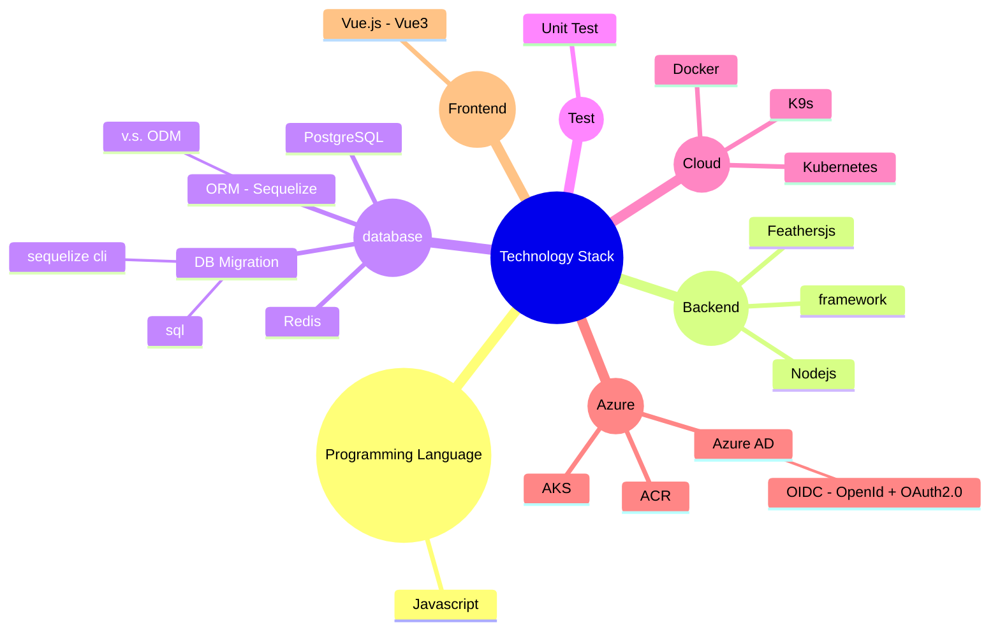

# Work Skill
###### tags: `skill`
---

<!--more-->
[toc]

# Programming Language
## Javascript

# Backend
## framework
### Nodejs
### Feathersjs

## database
### PostgreSQL
### Redis
### ORM (Sequelize)
#### v.s. ODM
### DB Migration
#### sql
#### sequelize-cli

## Test
### Unit Test

# Cloud
## Docker
## Kubernetes
## K9s

## Azure
### AKS
### ACR
### Azure AD
#### OIDC (OpenId + OAuth2.0)

# Frontend
## Vue.js (Vue3)
